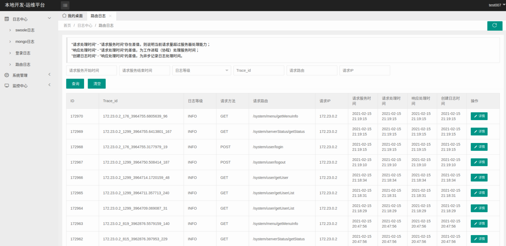

# wlsh-framework

> 名词解释：wlsh（ 为了生活---每个字的第一个拼音 ）

酷毙的码农为了生活自由，基于`composer`整合`swoole`等扩展组合而成的`php`内存长驻框架 ，低耦合，使用非常少的语法糖，尽量使用原有扩展中的语法，提供最优状态以减少`PHPer`学习新框架的成本。

| 分类 | 说明 |
| :------ | :------ |
官网|http://www.wlsh.xyz
文档|http://doc-v2.wlsh.xyz
联系邮箱|hanhyu@qq.com

### 使用基本要求

对于使用wlsh项目的开发者，需要掌握swoole基本的开发理念与php8语法，熟悉composer用法。

> 我们的口号：简单才是`php`美之所在，用最简捷、最高效、最性价比的方式获取项目资金中的利润最大化，绝对不会增加`phper`的学习成本。

### 框架特色

1. 完全现代化支持，最低php8版本

2. 可无缝同步升级swoole最新版本

3. 完全组件化

4. 框架只定义了一个入口两个核心，`其他流程都是使用方团队自己约定`，方便代码`review`

5. 基于`swoole`扩展组件，核心都是c扩展，其实wlsh不能叫做一个框架而是一个协程组件

6. 简约快速，核心没有复杂化的流程，可以最快速地上手（看一遍即可进入编码阶段）

7. 安全，wlsh框架核心文件没有封装swoole提供的原始方法及功能，这样团队可以个性化定制外界无感知、一个项目可以设定自己的一套框架流程

8. 高性能，wlsh协程框架在处理`业务型密集IO`方面不低于`golang`、`c++`的性能

9. 非常低耦合，`完全没有封装新的函数语法糖`、无依赖性; 无任何的封装带来的好处是，只要会php8与swoole就可以直接上手开发业务代码`需要php功底深厚，不适合新手`

10. wlsh组件已经历了五年时间的考验与N个线上项目的蹂躏

11. 文档中标记 `[供参考]` 内容可以替换成自己或团队的规则格式

12. 自带独特的运维管理后台：
    

### 该版本停止更新，3.0新版本转移到：wlsh-skeleton 仓库
